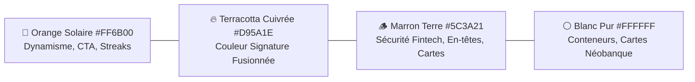

# 🎨 Spécifications de Design Visuel (Design System) — FinEdge Africa

## 1. Direction Artistique & Univers Fintech Africaine

L'identité visuelle de **FinEdge Africa** allie la **rigueur et la modernité des néobanques internationales** (Revolut, Monzo, Stripe) avec l'**énergie et la confiance de la terre ouest-africaine** (Teintes chaudes, Orange Solaire, Marron Terre cuivrée, Blanc pur et contrastes haute précision).

---

## 2. Palette de Couleurs & Tokens Fintech

| Rôle Sémantique | Nom du Token | Valeur Hex / CSS | Usage & Ambiance Fintech |
| :--- | :--- | :--- | :--- |
| **Couleur Signature** | `color-fintech-primary` | `#D95A1E` | Fusion cuivrée équilibrée Orange-Marron |
| **Dégradé Signature** | `gradient-fintech` | `linear-gradient(135deg, #FF6B00 0%, #7B3E19 100%)` | En-têtes de comptes, cartes virtuelles, CTA majeurs |
| **Accent Orange** | `color-action-orange` | `#FF6B00` | Boutons d'action, flammes de streaks, notifications |
| **Fond & Surfaces** | `color-surface-pure` | `#FFFFFF` | Fond des cartes de solde, fiches pédagogiques |
| **Fond d'Application** | `color-bg-subtle` | `#FDFBF7` | Fond écru chaleureux et reposant pour les yeux |
| **Succès / Profit** | `color-status-success` | `#00C076` | Gains de marge FCFA, validation quiz, solde positif |
| **Alerte / Risque** | `color-status-warning` | `#F59E0B` | Risque de crédit client, alerte trésorerie |
| **Danger / Perte** | `color-status-danger` | `#EF4444` | Découvert de caisse, mauvaise réponse |

---

## 3. Typographie Fintech : Famille Complète `Matt`

La typographie **`Matt`** apporte une structure géométrique moderne et lisible sur les petits écrans :
* **`Matt Black`** : Gros chiffres de solde et de gains XP (`35 000 FCFA`, `+150 XP`).
* **`Matt Bold`** : Titres de sections, intitulés des modules, cartes fintech.
* **`Matt Medium`** : Boutons d'action (CTA), pilules de filtres, choix du simulateur.
* **`Matt Regular`** : Textes de cours, dialogues de BD, explications bienveillantes.

---

## 4. Composants Clés de l'Univers Fintech

### A. Carte de Solde / Trésorerie façon Néobanque
* Carte virtuelle avec dégradé subtil Terracotta (`#FF6B00 ➔ #7B3E19`), puce de sécurité stylisée et affichage des soldes en Francs CFA (`FCFA / XOF`).
* Jauge de santé financière dynamique : Vert (Solide), Jaune (Vigilance crédit), Rouge (Tension caisse).

### B. Arbre de Progression Gamifié
* Chemin sinueux vertical avec nœuds 3D en relief doré, bannières de chapitres et coffres de trésors déverrouillables.

### C. Bulles & Cockpit BD
* Personnages expressifs (Awa, Tante Henriette, Grossiste) dans un style "Visual Novel" épuré avec bulles de dialogue claires et boutons de choix d'actions tactiles instantanés.
