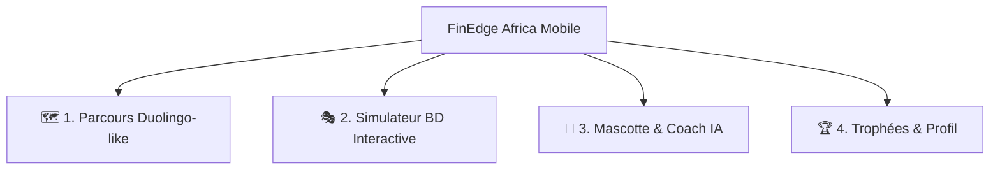
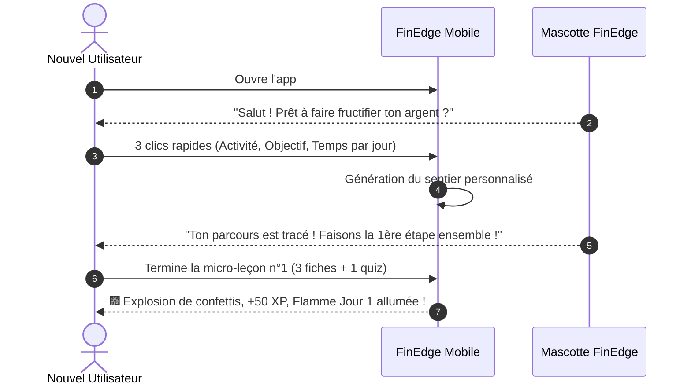

# 📱 Spécification de l'Expérience Utilisateur (EXPERIENCE.md)

## 1. Architecture de l'Information & Structure Mobile

L'application mobile FinEdge Africa repose sur une navigation principale à **4 onglets fixes**, pensée pour une prise en main immédiate à une main sur smartphone :

### Détail des Espaces :
1. **🗺️ Parcours (Accueil - Style Duolingo / Babbel)** :
   * **Header Flottant** : Mascotte animée, compteur de flammes de série (Streak 🔥), pièces d'or (XP 🪙) et indicateur réseau (Online / Mode Hors-ligne discret).
   * **Le Sentier Pédagogique** : Chemin vertical sinueux reliant les bulles de leçons. Chaque unité se conclut par un coffre de récompense ou un défi simulateur.
   * **Bouton d'action rapide "Reprendre"** en bas d'écran pointant sur la prochaine leçon inachevée.

2. **🎭 Simulateur Narratif (BD / Visual Novel)** :
   * Une immersion scénarisée dans un petit commerce (ex: Boutique de pagnes, Kiosque).
   * **Structure de l'écran** :
     * *En haut* : Bandeau de jauges en temps réel (Solde Caisse FCFA, Quantité Stock, Jauge de Confiance du Marché).
     * *Au centre* : Illustration de la scène avec le personnage visiteur (grossiste, client, proche) et sa bulle de dialogue.
     * *En bas* : Choix d'action à impact immédiat (Boutons colorés avec prévisualisation des conséquences).

3. **🦉 Coach Financier IA & Mascotte** :
   * Espace de discussion interactif et bienveillant incarné par la mascotte.
   * Suggestions dynamiques à une touche (*"Comment calculer ma marge ?"*, *"Aide-moi à faire un budget Wave"*).
   * Réponses courtes, structurées en listes à puces avec chiffres en gras.

4. **🏆 Trophées, Streaks & Profil** :
   * Vitrine des badges débloqués (ex: *"Maître de la Caisse"*, *"Épargnant d'Or"*, *"Série 7 Jours"*).
   * Suivi des compétences acquises et réglages de l'application (langue, devise, sécurité).

---

## 2. Parcours Détaillés (Key User Journeys)

### Flux 1 : Onboarding & Premier Nœud Débloqué (< 60 secondes)

---

### Flux 2 : Scène du Simulateur Narratif (Exemple Vente de Pagnes)
1. **Mise en situation** :
   * *Image* : Tante Henriette entre dans la boutique avec le sourire.
   * *Bulle dialogue Tante Henriette* : *"Mon neveu ! Donne-moi 2 pagnes Wax Hollande pour la fête de dimanche, je te paierai à la fin du mois !"*
2. **Options d'Action présentées au joueur** :
   * **Bouton A (Bleu)** : *"Accepter le crédit (Risque d'impayé : 50%, Vente notée au carnet)"*.
   * **Bouton B (Vert)** : *"Proposer un acompte de 50% maintenant et le reste à la livraison"*.
   * **Bouton C (Orange)** : *"Refuser poliment en expliquant le besoin de reconstituer le stock"*.
3. **Résolution & Feedback Pédagogique** :
   * La mascotte apparaît au bas de l'écran pour analyser l'impact du choix : *"Bien joué ! Demander un acompte protège le coût d'achat de ton stock tout en gardant une bonne relation client."*

---

### Flux 3 : Échange avec la Mascotte Coach IA
1. L'utilisateur clique sur la mascotte ou tape une question : *"Combien je dois garder pour les imprévus chaque mois ?"*
2. L'assistant répond avec bienveillance :
   * 📌 *Règle d'or* : Viser 10% à 15% de ses gains mensuels en épargne d'urgence sur un compte Mobile Money séparé.
   * 💡 *Astuce pratique* : Ne jamais laisser l'argent d'urgence sur le compte de retrait quotidien.
3. La mascotte propose une leçon associée : *"Veux-tu débloquer la leçon 'Le Coffre Secret du Mobile Money' ?"*

---

## 3. Gestion des États Particuliers & Mode Hors-Ligne

* **📶 Mode Hors-Ligne (Offline-First)** :
  * Le sentier de leçons et le simulateur BD sont 100% jouables sans aucune connexion Internet.
  * Les données de jeu, points XP et validations de chapitres sont stockées localement de façon sécurisée (SQLite/Isar) et se synchronisent silencieusement dès la reconnexion.
* **⚠️ Gestion des Erreurs & Quotas IA** :
  * Si la connexion coupe pendant le chat IA : la mascotte affiche un message chaleureux *"Oups, le réseau est un peu timide ! En attendant, voici les 3 conseils les plus demandés."*

---

## 4. Expérience Back-Office (CMS & Cockpit Équipe)

* **Éditeur de Sentier & Arborescence** :
  * Glisser-déposer des chapitres et des leçons sur le sentier vertical.
* **Éditeur de Scénarios BD pour le Simulateur** :
  * Interface no-code sous forme d'arborescence visuelle (nœuds de dialogues et branches de choix).
  * Prévisualisation dynamique sur mock mobile en temps réel.
* **Dashboard Analytics & IA** :
  * Cartographie des étapes où les utilisateurs bloquent pour ajuster immédiatement la difficulté des quiz.
