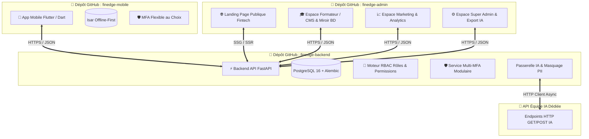

# 🏗️ Architecture Technique (Architecture Spine) — FinEdge Africa

## 1. Vision d'Ensemble & Stratégie Multi-Repos GitHub

Le projet FinEdge Africa est structuré en **3 dépôts GitHub indépendants (Multi-Repo)** :

---

## 2. Décisions Fondatrices Invariables (Architecture Decisions)

### `AD-1` : Dépôt Mobile — `finedge-mobile` (Flutter & Isar) `[ADOPTED]`
* **Binds** : Le code client mobile.
* **Rule** : Dépôt GitHub sous Flutter 3.x avec persistance locale Isar (Offline-First) et Design Fintech.

### `AD-2` : Dépôt Backend — `finedge-backend` (FastAPI & PostgreSQL) `[ADOPTED]`
* **Binds** : L'ensemble de l'API REST, les modèles relationnels, le moteur RBAC et le MFA modulaire.
* **Rule** : Dépôt GitHub sous **FastAPI (Python 3.11+)**, **SQLAlchemy 2.0**, **Alembic**, **Docker Compose** et validation **Pydantic V2**.

### `AD-3` : Dépôt Admin / Frontend Web — `finedge-admin` (Next.js 16, shadcn/ui, TanStack) `[ADOPTED]`
* **Binds** : La Landing Page publique et le Back-Office multi-rôles.
* **Rule** : Dépôt GitHub configuré avec :
  * **Landing Page Publique** : Présentation du produit, simulateur interactif, réassurance fintech.
  * **Espace Formateur / Pédagogie** : CMS No-Code, création de cours & simulateur miroir mobile.
  * **Espace Marketing & Growth** : Campagnes, relances, entonnoirs d'engagement & rétention.
  * **Espace Super Admin** : Gestion des utilisateurs, RBAC, paramètres et export des logs IA.

### `AD-4` : MFA Modulaire et Flexible (Mobile & Web) `[ADOPTED]`
* **Binds** : La sécurité d'authentification utilisateur et administrateur.
* **Rule** : Le MFA n'est jamais imposé de manière bloquante mais proposé à la carte :
  * **Options au choix** : SMS OTP, WhatsApp OTP, Application Authenticator (TOTP Google/Microsoft), Email OTP, ou Aucun (mode simplifié).
  * L'utilisateur configure ses facteurs de confiance à tout moment depuis son profil.

### `AD-5` : Intégration HTTP vers l'API de l'Équipe IA Dédiée `[ADOPTED]`
* **Binds** : La communication entre le backend FinEdge et le modèle IA conçu par l'équipe spécialisée.
* **Rule** : Le backend `finedge-backend` effectue des requêtes HTTP (GET/POST asynchrones via `httpx`) vers les endpoints fournis par l'équipe IA, avec masquage PII préalable.

### `AD-6` : Stratégie Git Flow Multi-Dépôts `[ADOPTED]`
* **Binds** : Le cycle de vie des branches pour chacun des 3 dépôts GitHub (`finedge-backend`, `finedge-admin`, `finedge-mobile`).
