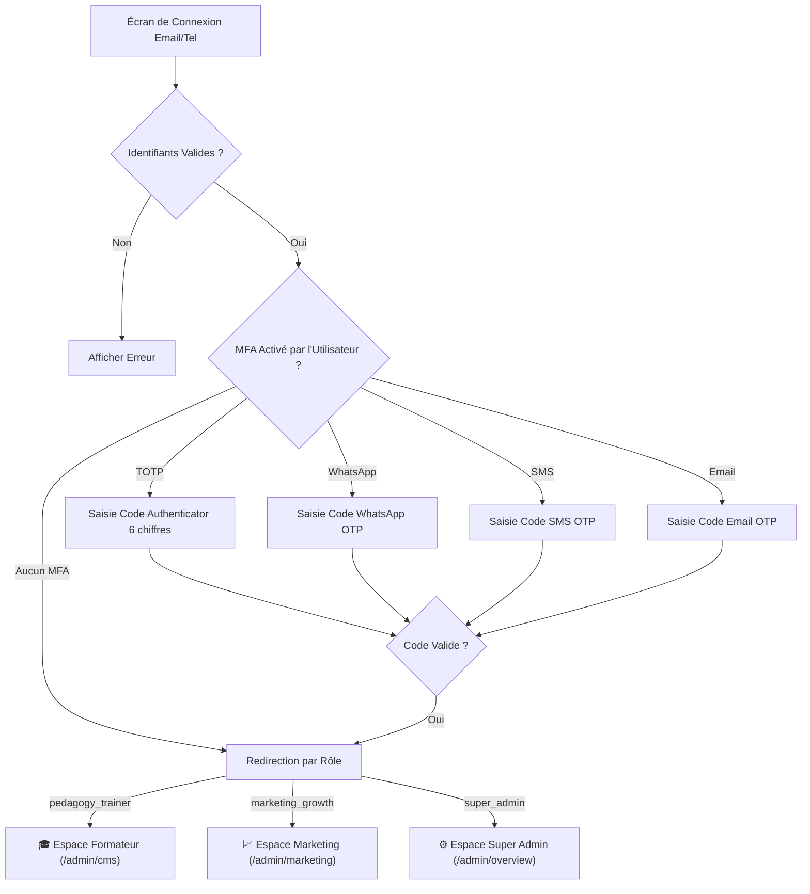

# 🐙 Spécifications Complètes & Détaillées des GitHub Issues — Dépôt `finedge-admin`

> **Projet** : FinEdge Africa — Frontend Web, Landing Page & Back-Office Multi-Rôles  
> **Stack** : Next.js 16 (App Router, React 19) / TypeScript / Tailwind CSS / shadcn/ui / TanStack Query v5 / TanStack Table / Lucide Icons  
> **Convention Git Flow** : Branche cible `develop`, branche de production `main`.

---

## 🎯 Milestone 0 : Landing Page Publique Fintech

---

### Issue #0 : [Landing] Vitrine Publique Fintech & Présentation de la Plateforme FinEdge

* **Branche Git Flow** : `feature/epic-0-public-landing-page`
* **Labels** : `frontend`, `landing`, `marketing`, `design`, `fintech`
* **Estimation** : 1.5 jours

#### 📝 Contexte & Objectif
Créer la vitrine publique officielle de FinEdge Africa sous Next.js 16 avec une direction artistique **Fintech haut de gamme** (Terracotta cuivrée `#D95A1E`, Dégradé `#FF6B00 ➔ #7B3E19`, Blanc Pur et police `Matt`). Cette page s'adresse aux futurs utilisateurs, petits commerçants, partenaires bancaires/microfinance et investisseurs.

#### 🗂️ Composants à créer
```text
admin/
├── app/
│   ├── (public)/
│   │   ├── page.tsx                           # Landing Page principale
│   │   └── layout.tsx                         # Header public + Footer
│   ├── components/
│   │   └── landing/
│   │       ├── HeroFintech.tsx                # Hero section avec mockups 3D
│   │       ├── InteractiveSimulatorDemo.tsx   # Démo interactive BD de pagnes
│   │       ├── MascotShowcase.tsx             # Présentation du coach IA Koko/Kini
│   │       ├── SecurityTrust.tsx              # Réassurance Fintech & MFA
│   │       ├── PersonasImpact.tsx             # Témoignages Awa (commerçante) & Ibrahim
│   │       └── PublicFooter.tsx               # Liens, mentions légales, accès portails
```

#### 🎨 Sections & Fonctionnalités
1. **Hero Section Fintech** :
   * Titre : *"L'Éducation Financière Pratique qui Fait Grandir vos Revenus en Afrique de l'Ouest"*.
   * Mockup smartphone animé présentant le sentier d'apprentissage et le cockpit de caisse en FCFA.
   * Boutons CTA : *"Télécharger l'Application"* (Android/APK) et *"Accéder au Portail Pro"*.
2. **Démo Interactive du Simulateur de Commerce** :
   * Mini-simulateur web interactif où le visiteur teste une décision de vente (ex: client demandant un crédit sur 2 pagnes Wax) et voit l'impact immédiat sur sa caisse virtuelle.
3. **Mascotte & Pédagogie par l'Action** :
   * Présentation du coach IA bienveillant avec exemples de questions locales (*"Comment séparer l'argent de la popote et de ma boutique ?"*).
4. **Réassurance Sécurité & Conformité** :
   * Chiffrement TLS, protection stricte des données personnelles (PII), options MFA à la carte.

#### ✅ Critères d'Acceptation (Given / When / Then)
* **GIVEN** un visiteur accédant à la racine du site `https://finedge.africa/`
* **WHEN** la page se charge
* **THEN** la Landing Page s'affiche en moins de 1.2s avec un score Lighthouse > 90.
* **AND** le mini-simulateur interactif permet d'effectuer un choix de vente et d'afficher le feedback immédiat sans rechargement.

---

## 🎯 Milestone 1 : Socle Next.js 16, Design System Fintech & Authentification Multi-MFA

---

### Issue #1 : [Setup] Initialisation Next.js 16, Tailwind CSS Fintech, Police Matt & shadcn/ui

* **Branche Git Flow** : `feature/epic-5-init-nextjs-shadcn`
* **Labels** : `frontend`, `setup`, `ui`, `fintech`
* **Estimation** : 1 jour

#### 📝 Contexte & Objectif
Poser l'architecture frontend du projet `finedge-admin` avec **Next.js 16**, **Tailwind CSS**, la typographie officielle **Matt Complete Family** et les composants accessibles **shadcn/ui**.

#### 🎨 Palette Fintech & Tokens (`tailwind.config.ts`)
```typescript
// Extrait des couleurs
colors: {
  fintech: {
    primary: '#D95A1E',        // Terracotta cuivrée fusionnée
    gradientStart: '#FF6B00',  // Orange Solaire
    gradientEnd: '#7B3E19',    // Marron Terre
    brown: '#5C3A21',          // Marron Chaud confiance
    surface: '#FFFFFF',        // Blanc Pur
    bgSubtle: '#FDFBF7',       // Fond écru reposant
    success: '#00C076',        // Gain FCFA / Validé
    warning: '#F59E0B',        // Risque trésorerie
    danger: '#EF4444',         // Découvert
  }
}
```

#### 🗂️ Structure des Composants de Base
- [ ] Initialiser `components.json` pour shadcn/ui.
- [ ] Installer les composants clés : `Button`, `Card`, `Dialog`, `Sheet`, `Tabs`, `Table`, `Badge`, `Input`, `DropdownMenu`, `Avatar`, `Toast`.
- [ ] Configurer la police `Matt` (Matt-Bold, Matt-Medium, Matt-Regular) dans `app/layout.tsx`.
- [ ] Créer le Shell d'administration avec Sidebar rétractable et Header utilisateur.

#### ✅ Critères d'Acceptation
- **GIVEN** le projet lancé via `npm run dev`
- **WHEN** on navigue sur `http://localhost:3000/admin`
- **THEN** la structure de base (Sidebar, Header, zone de travail) s'affiche avec les teintes officielles et la typographie `Matt`.

---

### Issue #2 : [Auth & MFA] Connexion, MFA Flexible à la Carte & Redirection par Rôle (RBAC)

* **Branche Git Flow** : `feature/epic-5-auth-flexible-mfa-rbac`
* **Labels** : `frontend`, `auth`, `mfa`, `rbac`, `security`
* **Estimation** : 1.5 jours

#### 📝 Contexte & Objectif
Implémenter la page de connexion sécurisée avec **MFA modulaire au choix libre de l'utilisateur** (TOTP Authenticator, WhatsApp, SMS, Email ou Sans MFA) et redirection intelligente selon le rôle de l'utilisateur.



#### 📋 Fonctionnalités à implémenter
1. **Écran de Connexion (`/admin/login`)** : Formulaire stylisé Fintech avec gestion des erreurs et état de chargement.
2. **Écran de Validation du Second Facteur (`/admin/login/mfa`)** : Détection automatique de la méthode configurée par l'utilisateur (TOTP, WhatsApp, SMS, Email).
3. **Gestionnaire de Profil & Sécurité (`/admin/settings/security`)** : Interface où l'utilisateur peut à tout moment activer, changer ou désactiver ses méthodes MFA.
4. **Middleware de Protection des Routes** : Empêche un formateur d'accéder aux réglages super admin ou un marketeur de supprimer des cours.

#### ✅ Critères d'Acceptation
- **GIVEN** un formateur connecté ayant activé le MFA WhatsApp
- **WHEN** il saisit son mot de passe
- **THEN** l'interface lui demande son code WhatsApp à 4 chiffres avant de le rediriger automatiquement vers `/admin/cms`.

---

## 🎯 Milestone 2 : Espaces Dédiés par Rôle (Formateur & Marketing)

---

### Issue #3 : [Espace Formateur] CMS No-Code des Parcours, Modules & Fiches de Cours

* **Branche Git Flow** : `feature/epic-5-trainer-cms-courses`
* **Labels** : `frontend`, `trainer`, `cms`, `pedagogy`
* **Estimation** : 1.5 jours

#### 📝 Contexte & Objectif
Fournir aux **Formateurs et Concepteurs Pédagogiques** une interface intuitive pour structurer les sentiers d'apprentissage, rédiger les fiches pratiques (ancrées dans les réalités de l'Afrique de l'Ouest) et concevoir les QCM.

#### 🗂️ Pages & Composants
```text
admin/app/(dashboard)/cms/
├── page.tsx                           # Arborescence des parcours et modules
├── [pathId]/
│   ├── page.tsx                       # Liste ordonnée des leçons du parcours
│   └── lesson/[lessonId]/
│       ├── page.tsx                   # Éditeur de leçon (Fiche + Quiz)
│       └── components/
│           ├── TheoryCardEditor.tsx   # Éditeur de fiches avec audio
│           └── QuizEditor.tsx         # Éditeur de QCM & feedbacks
```

#### 📋 Fonctionnalités Clés
- [ ] Arborescence visuelle avec glisser-déposer pour réorganiser l'ordre des leçons.
- [ ] Formulaire d'édition de fiche de cours : Titre, règles d'or financières (en FCFA), conseils Mobile Money, et champ URL pour l'audio vocal.
- [ ] Formulaire de Quiz : Question à choix multiples, définition de la bonne réponse, points XP attribués (ex: 50 XP), et message explicatif bienveillant de la Mascotte.
- [ ] Bouton global "🚀 Publier la nouvelle version du cours" pour incrémenter le numéro de version de synchronisation mobile.

#### ✅ Critères d'Acceptation
- **GIVEN** un formateur créant une nouvelle leçon sur *"Comment calculer sa marge de pagne"*
- **WHEN** il renseigne la fiche, configure le quiz et clique sur "Enregistrer"
- **THEN** la mutation TanStack Query sauvegarde la leçon dans PostgreSQL et met à jour l'arborescence instantanément avec un toast de succès.

---

### Issue #4 : [Espace Formateur BD] Studio de Scénarios BD avec Miroir Smartphone en Direct

* **Branche Git Flow** : `feature/epic-5-comic-mirror-preview`
* **Labels** : `frontend`, `trainer`, `simulator`, `mirror-preview`
* **Estimation** : 2 jours

#### 📝 Contexte & Objectif
Créer l'outil phare pour les formateurs : un **Studio de Scénarios BD** avec un **Miroir Smartphone virtuel en temps réel** sur la droite de l'écran, permettant de concevoir les interactions du simulateur de commerce (Vente de pagnes, négociation de crédit).

```mermaid
graph LR
    subgraph Formulaire Formateur (Gauche)
        CharacterSel[Sélection Personnage : Tante Henriette]
        DialogueInput[Réplique : 'Donne-moi 2 pagnes à crédit !']
        ChoicesInput[Boutons : Comptant / Acompte 50% / Refus]
    end

    subgraph 📱 Smartphone Miroir en Direct (Droite)
        ScreenFrame[Cadre Mobile Haute Définition]
        LiveStall[Boutique de Pagnes & Caisse 50 000 FCFA]
        LiveBubble[Bulle de Dialogue avec Police Matt]
        LiveButtons[Boutons de Choix Tactiles Cliquables]
    end

    CharacterSel & DialogueInput & ChoicesInput ==>|Mise à jour sans latence| ScreenFrame
```

#### 📋 Composants à développer
- [ ] `admin/components/simulator/ComicSceneEditor.tsx` : Formulaire de saisie du dialogue, du personnage (avatar, humeur) et de la matrice des choix financiers (impact caisse, stock, dette).
- [ ] `admin/components/preview/PhoneMirrorFrame.tsx` : Composant cadre smartphone (iPhone/Android) avec :
  * Cockpit de caisse flottant (Solde FCFA, Stock de pagnes restants),
  * Bulle de dialogue animée avec typographie `Matt`,
  * Boutons de choix tactiles interactifs : le formateur peut **cliquer sur un choix pour voir la réaction de la Mascotte** en direct.

#### ✅ Critères d'Acceptation
- **GIVEN** le studio de scénarios BD ouvert
- **WHEN** le formateur tape une réplique ou ajuste un montant en FCFA
- **THEN** le smartphone miroir sur la droite reflète immédiatement le rendu exact sans recharger la page.

---

### Issue #5 : [Espace Marketing] Dashboard Analytics, Rétention & Gestion des Campagnes

* **Branche Git Flow** : `feature/epic-5-marketing-growth-dashboard`
* **Labels** : `frontend`, `marketing`, `analytics`, `growth`
* **Estimation** : 1.5 jours

#### 📝 Contexte & Objectif
Fournir à l'équipe **Marketing & Growth** un tableau de bord complet pour analyser l'acquisition des utilisateurs, l'entonnoir d'engagement et piloter les relances de streaks.

#### 📊 Tableaux & Graphiques à intégrer
1. **Entonnoir de Conversion (Funnel)** :
   * Téléchargement ➔ Diagnostic Onboarding complété ➔ 1ère Leçon validée ➔ Série de 7 jours (Streak).
2. **Métriques de Gamification & Rétention** :
   * Répartition des séries de flammes actives (1 jour, 3 jours, 7 jours, 30+ jours).
   * Taux de complétion par thématique (Épargne, Gestion de Caisse, Mobile Money).
3. **Tableau TanStack Table des Parcours** :
   * Filtrage et tri par taux d'abandon pour détecter les leçons nécessitant une relance marketing ou une simplification.
4. **Gestion des Bannières & Notifications** :
   * Formulaire pour programmer des bannières promotionnelles ou des messages de motivation sur l'accueil mobile.

#### ✅ Critères d'Acceptation
- **GIVEN** l'accès à l'espace `/admin/marketing`
- **WHEN** les données sont récupérées du backend
- **THEN** les graphiques de rétention et l'entonnoir de conversion s'affichent avec des filtres temporels (7j, 30j, 90j).

---

## 🎯 Milestone 3 : Espace Super Admin & Passerelle Équipe IA

---

### Issue #6 : [Espace Super Admin] Supervision des Échanges IA & Export pour l'Équipe IA

* **Branche Git Flow** : `feature/epic-5-superadmin-ai-export`
* **Labels** : `frontend`, `superadmin`, `ai`, `export`
* **Estimation** : 1 jour

#### 📝 Contexte & Objectif
Fournir aux **Administrateurs et Partenaires IA** un espace dédié pour superviser les requêtes posées à la mascotte et exporter en un clic les jeux de données anonymisés pour ré-entraîner le modèle d'intelligence artificielle.

#### 📋 Fonctionnalités Clés
- [ ] **Tableau de Bord des Conversations IA** (TanStack Table) :
  * Affichage des prompts (anonymisés : numéros masqués), catégories détectées (*Épargne*, *Commerce*, *Mobile Money*), latences de réponse (ms) et satisfaction utilisateur (pouce vert / rouge).
- [ ] **Filtres Avancés** : Par plage de dates, par thématique ou par questions mal notées.
- [ ] **Bouton d'Export Sécurisé "📥 Télécharger le jeu de données pour l'équipe IA"** :
  * Génère et télécharge un fichier `finedge-ai-training-data-[TIMESTAMP].json` ou `.csv` prêt à être envoyé à l'équipe IA.
- [ ] **Gestion des Collaborateurs & Rôles** :
  * Liste des utilisateurs du Back-Office avec assignation des rôles (`pedagogy_trainer`, `marketing_growth`, `super_admin`).

#### ✅ Critères d'Acceptation
- **GIVEN** un super administrateur sur la page `/admin/ai-insights`
- **WHEN** il clique sur "Télécharger le jeu de données pour l'équipe IA"
- **THEN** le fichier JSON propre et horodaté est immédiatement téléchargé.
- **AND** aucune donnée sensible ou numéro de téléphone personnel ne figure dans l'export.
